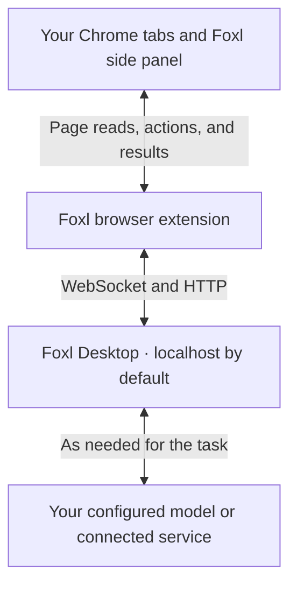

<p align="center">
  <a href="https://foxl.ai"></a>
</p>

<h1 align="center">Foxl Browser Extension</h1>

<p align="center">
  <strong>Your browser. A little more capable.</strong><br />
  Let your Foxl agent work in the Chrome tabs you already use.<br />
  Open source. Plain JavaScript. Connected to your desktop.
</p>

<p align="center">
  <a href="https://chromewebstore.google.com/detail/foxl/ijlihobebaeangjiacfomjdkhlpbmlhi"><strong>Add to Chrome</strong></a> &nbsp;·&nbsp;
  <a href="#get-started">Get started</a> &nbsp;·&nbsp;
  <a href="#permissions">Permissions</a> &nbsp;·&nbsp;
  <a href="docs/DEVELOPMENT.md">Developer guide</a> &nbsp;·&nbsp;
  <a href="LICENSE">License</a>
</p>

Foxl's browser extension gives your desktop agent a way to read pages, follow links, fill forms, and move between tabs. It works with your existing browser session, so you can bring the sites you already use into a conversation.

The extension is the browser connection. **The Foxl desktop app runs the agent** and connects to the model you choose. Both need to be running on the same computer for the default setup.

## Get started

You need **Chrome 116 or newer** and [Foxl Desktop](https://github.com/foxl-ai/foxl#get-started).

1. **Install the extension** from the [Chrome Web Store][chrome-store].
2. **Open Foxl Desktop.** The extension discovers the local app automatically.
3. **Open the Foxl side panel** from Chrome's toolbar and check the connection status.
4. **Start with a small task.** Open a page and ask Foxl to help with it.

> “Summarize this page and list the questions I should ask next.”

The store installation updates through Chrome. The extension ID is `ijlihobebaeangjiacfomjdkhlpbmlhi`.

### Install from source instead

The checkout can be loaded directly; no build or dependency installation is needed.

```sh
git clone https://github.com/foxl-ai/browser-extension.git
```

Open `chrome://extensions`, turn on **Developer mode**, select **Load unpacked**, and choose the cloned `browser-extension` directory. Reload the extension from that page after changing its source.

The extension targets Chrome. Other Chromium browsers may work, but these instructions and the store link are for Chrome.

## The ideas behind the extension

**Work where you already are.** Your open tabs, familiar websites, and existing sessions stay part of the task. The side panel keeps the conversation beside the page.

**Make access understandable.** Every requested permission is documented below and tied to its use in the source. A small codebase and a dependency-free runtime make inspection practical.

**Keep the connection visible.** Connection status, page indicators, and stop controls help you follow the work. Chrome's site-access settings let you choose which sites the extension can use.

**Make the package reproducible.** The build script uses an explicit file list, stable ordering, and fixed timestamps. You can rebuild the archive and compare it with another build.

## How it works



The content script turns a page into a compact tree of labelled elements. The agent can refer to those elements when it clicks or types:

```text
navigation [ref_1]
  link "Products" [ref_2] href="/products"
  link "About" [ref_3] href="/about"
textbox "Search" [ref_4] placeholder="Search..."
button "Sign in" [ref_5]
```

Screenshots provide a separate visual view. A service worker handles the desktop connection, tab management, and command dispatch; content scripts carry out page actions and display activity indicators.

## Where your data goes

**By default, extension traffic goes to Foxl on your computer.** It discovers `http://localhost:13847`, with `http://localhost:3847` as the fallback. The options page can override that server URL; a custom endpoint changes where extension data is sent.

Page text, screenshots, tab URLs and titles, and chat requests can pass to that configured server. Foxl Desktop may then send task context to your chosen model provider or connected service. Local transport between Chrome and Desktop does not mean every part of the task stays on your computer.

The extension has no analytics endpoint, remote configuration, or remotely hosted executable code. Settings are stored in `chrome.storage.local`.

The network entry points are small enough to inspect directly:

| Source | Requests |
| :--- | :--- |
| [Service worker](src/service-worker.js) | Health probes at `/api/health`, a WebSocket at `/extension`, and chat requests at `/api/chat` |
| [Options page](src/options.js) | Health probes and connection tests at `/api/health` |

```sh
grep -rnE 'fetch\(|XMLHttpRequest|new WebSocket|navigator.sendBeacon' src/
node scripts/audit.mjs
```

[Extension privacy details](PRIVACY.md) · [Foxl privacy policy](https://foxl.ai/privacy) · [Report a security issue](SECURITY.md)

## Permissions

The manifest requests access to all sites so the agent can work on the pages you choose. You can restrict **Site access** in the extension's Chrome settings.

| Permission | What it enables |
| :--- | :--- |
| `<all_urls>` | Read and interact with pages; capture the visible tab. |
| `tabs` | Read tab titles and URLs, navigate, and open, switch, or close tabs. |
| `scripting` | Inject the page reader into a frame when needed. |
| `tabGroups` | Organize tabs opened for agent tasks. |
| `sidePanel` | Show the conversation beside the current page. |
| `storage` | Save connection settings locally. |
| `alarms` | Maintain the service worker's connection lifecycle. |

The extension does not request the `cookies`, `webRequest`, or `debugger` APIs. Its page access can still expose sensitive content visible on a website, so choose site access with that in mind.

[manifest.json](manifest.json) declares the permissions. [scripts/audit.mjs](scripts/audit.mjs) checks permission usage and the network and executable-code surface in CI.

## Find your way around

| Path | Purpose |
| :--- | :--- |
| [src/service-worker.js](src/service-worker.js) | Connection, tabs, and command routing |
| [src/content-scripts/](src/content-scripts/) | Page accessibility tree and visual indicators |
| [src/sidepanel.js](src/sidepanel.js) · [sidepanel.html](sidepanel.html) | Side panel conversation |
| [src/options.js](src/options.js) · [options.html](options.html) | Server selection and connection checks |
| [scripts/](scripts/) | Source audit, reproducible packaging, and icon generation |
| [CHANGELOG.md](CHANGELOG.md) | Version history |

## Develop and contribute

Use **Node.js 20 or newer** for the audit and package build:

```sh
node scripts/audit.mjs
node scripts/build.mjs
```

The build writes versioned and `latest` ZIPs plus `SHA256SUMS.txt` to `dist/`. Dependencies are needed only if you want to regenerate the PNG icons.

The [developer guide](docs/DEVELOPMENT.md) covers debugging, package comparison, and releases. For a change, open a pull request with the problem, the resulting behavior, and how you verified it. CI checks the audit, reproducible build, and manifest/changelog agreement.

## Help and license

[Report a bug or suggest an improvement](https://github.com/foxl-ai/browser-extension/issues). Include the extension version, Chrome version, operating system, and reproduction steps.

Report vulnerabilities privately to [security@foxl.ai](mailto:security@foxl.ai); see [SECURITY.md](SECURITY.md).

Licensed under [Apache-2.0](LICENSE). See [NOTICE](NOTICE) for attribution.

<p align="center"><sub>Part of <a href="https://foxl.ai">Foxl</a> · Your day. A little lighter.</sub></p>

[chrome-store]: https://chromewebstore.google.com/detail/foxl/ijlihobebaeangjiacfomjdkhlpbmlhi
